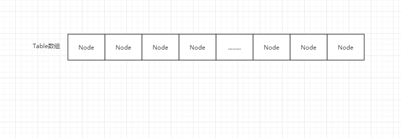

# 前言

在使用java的同学应该对HashMap的应用并不陌生，但是底层存储的原理，数据结构，和get时如何高效的命中key可能接触的比较少.

#### HashMap简介

Map是Key-Value对映射的抽象接口，Map用于保存具有映射关系的数据。Map集合里有两组值，一组值用于保存Map里的key，另外一组值用于保存Map里的value，key和value都可以是任何引用类型的数据。key不允许重复，key和value之间存在单向一对一关系，通过key能找到相应的value。

HashMap是基于哈希表的Map接口的实现，以Key-Value的形式存在，即存储的对象是Entry(同时包含了Key和Value)。在HashMap中，根据hash算法来计算key-value的存储位置并进行快速存取。最多只允许一条Entry的键为Null，但允许多条Entry的值为Null。此外，HashMap是线程不安全的。

#### 数据结构

